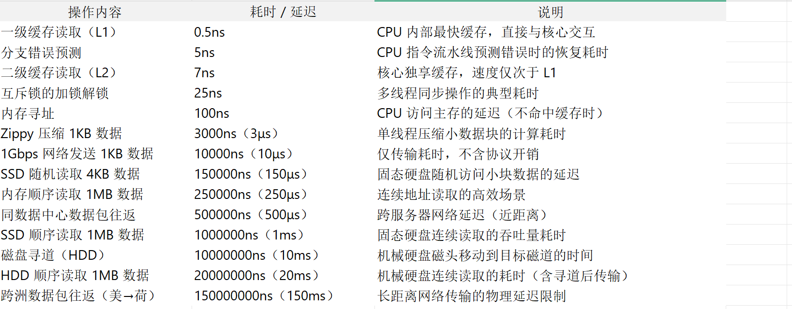
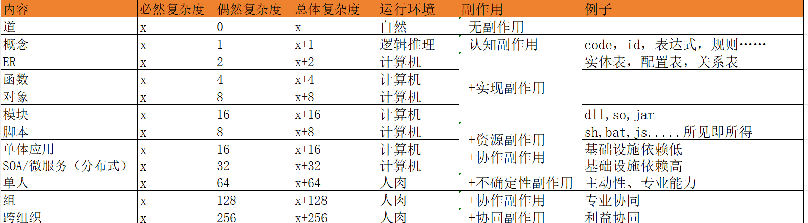

# 设计方法

| 适宜复杂业务 | 架构思想                  | 作用             | 
|--------|-----------------------|----------------| 
| 低、中、高  | [低熵设计](设计/1低熵设计.md)   | 降低整体复杂度，提升工程效能 | 
| 中、高    | [复杂度分离](设计/2复杂度分离.md) | 高可靠、高可维护、高可扩展  | 
| 中、高    | [关注点分离](设计/3关注点分离.md) | 组织不同专业技能的人协作   | 
| 中、高    | [不可变架构](设计/4不可变架构.md) | 高可靠、高可用        | 

# 经验总结

[恒生赢时胜重构项目同时陷入焦油坑经验总结](经验总结/复杂业务重构项目焦油坑经验总结.md)

[领域驱动战术设计](经验总结/领域驱动战术设计.md)

[如何快速掌握一个业务领域](经验总结/如何快速掌握一个业务领域.md)

[如何快速落地一个领域的架构](经验总结/如何快速落地一个领域的架构.md)

[AI的思考](经验总结/AI.md)

 

# 常用参考
**性能天梯**

**形势复杂度和副作用天梯**

