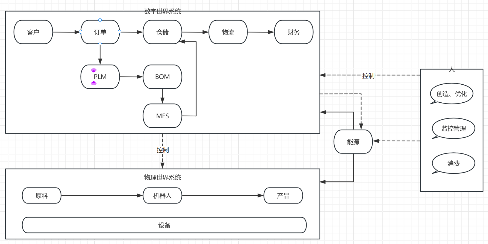

 

# AI的作用
最近频繁使用AI，有一些感想。

其实前年时候，帮贾老师带智能座舱推荐团队的时候已经接触过半年的AI。

当时AI的业务场景是一些图片识别、语音识别、文字识别。依然比较傻，做出来的东西有很明显的AI味。

很多专家对AI判断依然是一个概率工具。没有真正的智能。
你不懂的东西，问他，感觉他很专业。你懂的东西问他，感觉他在瞎编。在通用知识上，他是更好的搜索
引擎，在细分领域上，比较容易落地的改进是RAG但效果差，训练调参成本高昂———但大部分企业
没有这个能力和人才和财力（一张卡90B150w，DeppSeek满血最低要求700B,最低硬件投入近千万了）。

一年多过去了，随着MCP，agent等技术的发展。在AI Coding这个领域，取得了令人惊叹的效果。

简单的CRUD功能，他100%能替代；复杂的业务功能、技术方案，它也能完成，并且很80%情况下很优秀；
人需要针对AI的不足做引导、评审、决策。

# 为什么是AI Coding取得了突破

1，这本质是个细分市场、是AI实用化的必经之路

2，对软件公司而言，这是主场：经验最多、数据最多

3，先解决自身的限制、摸索出方案，才能解决别人的限制

# AI Coding做了那些事

    1，代码训练：让AI有很强的编码能力。 
    2，流程编排：围绕编程行业作业流程、进行工程训练和优化
    3，提示词：多AI角色分工、专业能力侧重、互相纠偏 
    4，上下文工程（Context Engineering）:一个上下文、目标驱动、提升多AI协作一致性
    5，MCP：获取特定知识、补偿训练数据 
    6，Agent：function calling：行动能力

其中1的本质是行业数据积累。2是行业模式抽象+AI训练（最大技术门槛是这个） 3456都是通用，并且改造成本相对较低的。

# AI Coding对编程行业的影响

用下来，感觉写代码比例急剧降低，至少80%左右不用写了（claudecode比例会更高）、会提问、会验收、有判断力很重要。
编程行业可能会变得像保安一样了，只需要看监视器就行了。

    1，橘色部分基本是CRUD，ER模型决定了，基本就决定了。人工做少量检查即可。
    2，黄色部分可根据业务流程和需求生成、因为是核心，人工需要做大量辅助检查、兜底、测试。
            这部分尽量用初、中级工程师去做。以海量产品工厂策略去市场上快速试错。
            强调的是快速、变化、指标驱动、数据驱动。
    3，底层是业务引擎、技术引擎等基础设施，一般包括
            流程引擎：实现业务流程，编排底层业务和技术组件，实现业务积木化组装。架构形状为线。
            业务引擎：屏蔽业务复杂性。架构形状为点。
            PAAS：屏蔽技术复杂性。架构形状为点。
    4，在编排之外的市场分析、设计、业务引擎和技术引擎的设计和改造。需要高级的工程师、架构师、产品经理来完成。

1，开发，动手类工作比例急剧降低。

2，规划、设计、管理、治理类、维护类工作比例急剧提升（总体数量未必）

3，人AI结合非常重要，短期内他还替代不了人，10年不敢保证，5年内一定是人机结合的。

 
 
# 非传统行业的影响

基本可以判断AI很快将从Coding细分市场扩展到其他领域。

    AICoding突破不是在人力资源要求最高的算法上突破的，而是在应用层，如训练、编排、MCP……门槛其实非常低。

其他行业最大的障碍可能数据和材料未必像软件行业那么丰富。

也许未来已来

只是不清楚，是好是坏。

 

# 附录：

AI使用体验

1，cline的计划模式很不错

2，claude在编码上，非常强，达到企业级开发水准；cline做简单任务不错

3，两个用久了都会崩溃，卡顿，需要小步提交；清理后重新来

4，回滚能力缺乏

5，claude在大工程分析、理解上是不错的

6，最佳实践

    /init
    做好工程结构
        工程化：多角色协作
        模块化：各个目录，模块职责单一，架构模式单一，否则就要人工介入
    做好提示词工程（和工程结构、开发流程、角色密切相关）
        CLAUDE.md
        AGENTS.md
    做好版本控制、每个流程和角色都要小步、有标准提交物
    单元测试、快速集成验证
    防止agent变更代码、做好回滚；代码越多越要慎重的用它

7，清算系统，用AI设计了3天，最终核心还是自己写。

AI还是太飘了，很容易越做越大，失控。

我自己写，核心其实有不到10个类。

他光文档就生产了几十个了。

最佳的方式，还是人想清楚了，把核心设计好。让他做外围。

 

