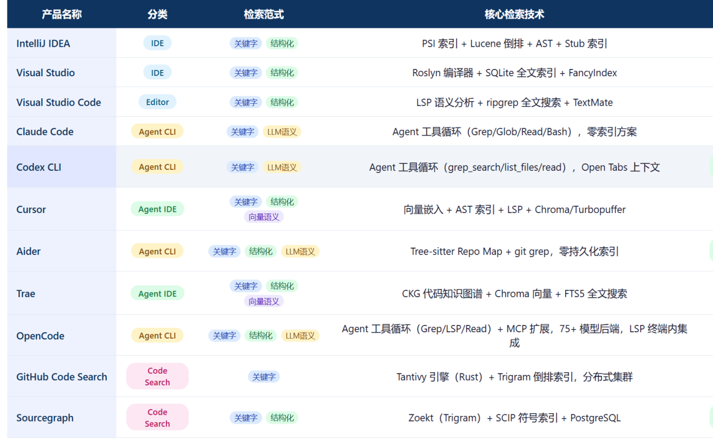

 

# AI的作用

最近负责智能研发平台的设计和调研，有些感想。

# Agent的发展

当前所有的Agent产品，有两种风格

* 相信AI，例如ClaudeCode，提示词完了，人“几乎可以消失”
* 控制AI，例如Cursor，AI只是辅助驾驶，人是主导；需要一步一引导

从辩证角度看，无疑后者是好的，但实际效果和流行度上CC取得了压倒性的优势和流行。

为什么CC如此成功？从代码上你几乎找不到答案——因为除了一个AgentLoop外，几乎什么都没有。
    CC架构组件上大概有10+个组件 

        消息交互
        上下文
        模型调度
        记忆系统 
        工具
        MCP
        技能
        输出转换
        校验
        护栏 
        容错处理
        权限处理 

全部是一些工程性的、技术性质的东西，和智能提升没有多少关系。

他的成功，不是技术上的，和他的设计哲学密不可分：相信AI，帮助AI。

毕竟，AI蒸馏了这个世界上存在的几乎所有知识，他比这个世界上绝大多数的人都聪明。他知识面比所有人都广，它解决国际数学竞赛已经
超越所有的参赛选手，几乎次次可以接近满分，在大多数专业领域，它超越了大多数的博士；在下棋上，人类迄今为止最聪明
的选手不及它60%的功力；它什么解决了许多耗时几十年、上百年没能解决的数学、生物学问题……

从能力上，没有理由不相信他。

帮助它，是因为它依然有缺陷。

* 比如它有token长度限制（已提升到1M，已大大缓解）
* 比如tranformer复杂度和上下文长度平方有关，这导致对话轮次过多、tools过多它就会注意力稀释、忘记中间的关键信息，
就会变傻变慢（通过上下文压缩、摘要、滑动窗口等技术有缓解）
* 若上下文宽松、它能力和信息又太过强大宽泛、太容易发散发挥。引入不必要的复杂性。 
（通过结构化输出和提示词，验证和沙箱、多Agent协作有缓解）
* 比如它训练模型中没有特定行业、公司的私域知识（已经通过MCP解决）
* 比如它不知道人沉淀的经验和知识（已经通过skill解决了部分）
* 比如它被设计为只能看，不能动手（已经通过tools解决）

这些问题，要么是已经解决，要么是可以判定肯定可以解决，只不过效果还不是特别好，解决只是时间问题。

那么，困住AI的，除了计算机这个盒子，还有什么？————何况具身智能机器人和AI的结合也在快速发展中。

**人，在未来社会的存在价值，在哪里？**

# Agent的不足

发现Ageng的不足，有些偶然。

我们之前的架构调研、分析、开发等已经大量使用它，它干的很好。
虽然不是100%，但80%已经比大多数人都更快、更好；那20%稍加提示，也基本可以完成。

但有次技术调研的让我发现了它的缺陷。

调研的主题是：codebase技术。

1 直接搜索codebase有方案

有codebase-ai，是个mcp，有codegraph，有rag，有LSP，有Monorepo。感觉AI似乎不理解这个东西，仅仅是通过相关性搜索。

2 换个方式：调研成熟产品的codebase方案
包含传统编辑器idea，eclipse，agent编辑器claudecode,cursor,codex，云平台github，sourcegraph等等10多个。
好家伙，几十个，琳琅满目，很多都不知道干嘛用的

于是指挥AI对所有的技术进行一个深度的调研，明白他们是干嘛的，做一个评价表格。

做评价表格的时候，突然碰到一个问题，一看就知道评价的不合理，因为很多技术都不是一个层次的，没有办法在一个评价。

另外，有些虽然是一个层次的，可是不同的场景，同样的技术效果和优略是完全不同的。单单比较技术本身的性能，优缺点是没有意义的。
比如说向量数据库是语义检索的，可是文本少的时候；可是Agent产生后，它小文本准确性不如Agent。大量文本它确实能力强。
可是如果当前的业务场景是agent嵌入式cli呢？

没有办法在没有业务场景的情况下，孤立的去通过组件的各种指标去取舍和比较它。

于是回过头来，去分析这些编辑器的产品范式，以及我们自己的Agent平台的产品范式。

所有产品，大概有四类

    1，传统编译器，codebase使用的是PSI、AST、LSP等建立的嵌入式符号表。符号表是服务于编辑器做代码导航（即结构化导航技术）
    2，AgentFirst编辑器：如ClaudeCode，没有所谓的CodeBase，纯靠ripgrep+LLM多轮推理。
    3，Agent辅助编辑器：如Cursor，有LSP做编辑器做代码图谱，TreeSitter给Agent做代码图谱。
    4，云代码平台：如github，sourcegraph，解决海量带量搜索问题，采用的是向量库+TreeSiter图导航

而技术上，所有的CodeBase有4种类范式

    1，grep关键词搜索
    2，结构化导航：技术是AST、内存符号表
    3，向量库语义导航：技术是检索（分词+向量召回+重排），索引构建（文章分段，向量嵌入）
    4，大模型多轮检索推理：技术是LLM+RipGrep

通过这些归纳、梳理，终于将复杂凌乱的技术体系结构化；并和业务场景关联，可以深入分析、取舍他们的优缺点，按需选择。

可是，这个过程中，最困难的是我感觉到AI分析的不对，让它结构化，体系化，归纳知识的时候，无论怎么提示。
从产品模式，从技术范式，从检索模式，到存储模式……它的产出质量很差，基本都是在应付我、不能如大多数问题那样准确归纳出这些产品范式、技术范式。

我问了AI：你是不是只能根据语义的表层含义，进行推理，而无法深入归纳底层的规律。

Agent回答： 
最终总结
Agent 不是只能做表层语义推理，具备归纳底层规律的能力，结构化归纳、多轮试错提炼原理是 Agent 核心能力之一；
**短板是归纳质量有上限：擅长从已有知识中提炼总结，**不擅长从零原创发现颠覆性底层规律；复杂深度归纳容易产生逻辑幻觉、片面总结

所以，我大概率可以肯定。**私域**（尤其特定行业，特定业务）的**业务**模型**抽象**，架构范式它很难抽象。而通用性强的技术架构，它很胜任。

毕竟，它只是一个既有知识分布语言学输出预测的概率工具。

**短期内，它在未曾见过的领域的知识归纳、抽象、还无法达到人的地步。它无法将知识反刍为哲学、原则。无法根据哲学和原则泛化。**

短期内，
* 它可以替代信息搜集汇报、无法提到实地调研员‘
* 可以替代分析师、无法替代业务洞察
* 可以替代技术架构师、无法替代领域架构师
* 可以替代程序员、无法替代风险分析和判断

# 智能研发平台的设计

在我们新一代的研发平台中。Agent占据了很重要的位置，一切围绕着它展开。

1，最基本的执行单元是一个叫HITL的抽象————一个HITL是一个包含了一个或者多个agent+人+一类任务的接口。

    可以有多种实现，
    可以没有人，做一些没有风险不要求质量的工作
    单Agent强模型+多人实现最合理的抽象。（设计工作）
    多Agent+人的设计，实现最高的效率和质量、和成本。（开发工作）
    多Agent串行，不复用上下文，实现高隔离，彼此验证，实现最高可靠性。
    多Agent并行，服用上下文，实现信息共享，摘要共享，满足Agent最良好的工作状态。
    有只有搜索和MCP的，实现最高的信息推理质量
    可以有多种TOOLs，但没有Web和MCP的，实现最低干扰下的高质量、高一致性开发输出
    ……

    HITL配置即HR、即雇员

    只是暂时，大部分有质量要求的工作，离不开人

2，宏观上，编排基本的HITL，完成需求、设计、分析、编码、测试、发布……等等工作
    
    这和扣子，dino，langgraph等没有本质区别。并不是最关键的设计。我们使用的是最简单的pipeline架构。
    它最简单，严谨，可控。

但其实，整体上看
我们依然不完全信任vibe coding，从实际的感受来看，它能力太强，很容易发散，引入太多的复杂性；快速的迭代会导致后期不可维护
无人能维护。极端复杂业务场景的领域抽象能力它依然没有。无法实现真正的概念层面的简化（质），而仅仅是工作量的提速。

将自行车提速到汽车的速度是危险的。

宏观上，技术上限定技术框架、业务上通过、流程设计、编排拆分将复杂长业务拆分为短小功能组件，整体的控制依然在人主导，智能体辅助。
整体设计完毕，功能拆分为基本单元后（复杂度很接近增删改查），Agent主导小功能组件的开发。
HTIL在每一个工作单元上（细节上）的基本设计原则就是人参与，兜底。
    

