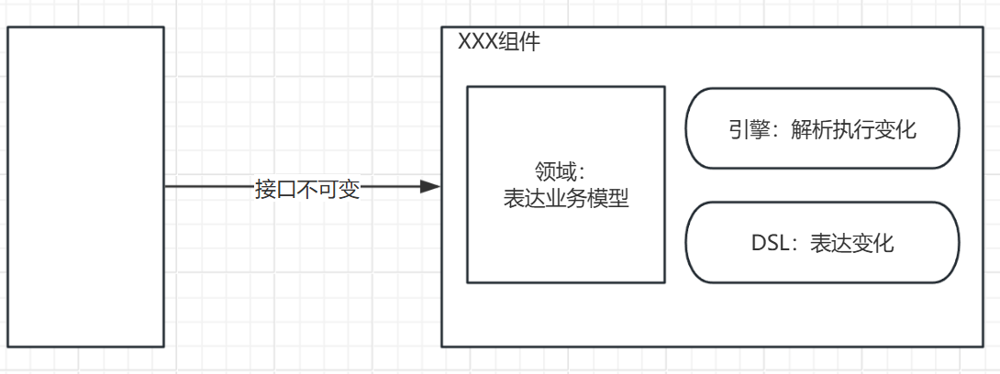
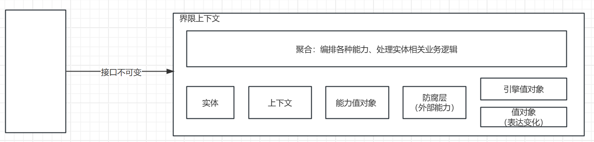
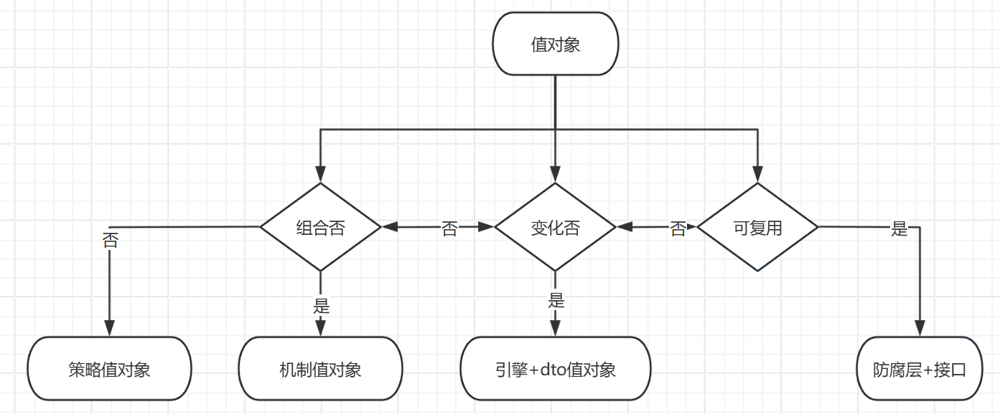

# 领域驱动的精华

 
## 战术模型 

不可变架构设计
  

DDD战术模型

可以看到DDD的战术模型和不可变架构设计是高度契合的。并且做了细化。

    1，实体
        聚合：编排内部、外部各种能力、实现对实体的处理逻辑。
    2，值对象
        广义值对象：不可复用的能力（内部）。
        狭义值对象：变化的能力（内部）
    3，上下文
        聚合对内外信息的总体感知。

## 值对象（狭义，表达变化的值对象）

值对象的引入是DDD的精髓内容之一，是化变化为不变的关键设计。

值对象等于c语言中的名言：面向数据结构编程。
 
## 聚合
剥离变化和不变，并不意味着架构就是清晰的，低耦合的。因为世界是变化的。如何用不变组合变化？

聚合是DDD原创的最精髓设计概念————等价于传统设计中的组合思想。

1. 流程编排（例如liteflow，dify，n8n）
2. 服务聚合层（facade/ESB）
3. 用户聚合（例如谷歌的查询表达式、github的搜索表达式，linux的管道模式）

## 上下文 

c语言进化为oo以后，杜绝了全局指针。全局变量。那么，如果有全局的耦合关系，应该放在哪里？

例如
对环境的依赖。对不确定的运行时变量的依赖（错误次数）
 
这一类，统一用上下文。
1，他不是静态的，全局的。
2，他对特定场景，就是某种全局

比如

ApplicationContext

SessionContext

RequestContext

Env
……

 