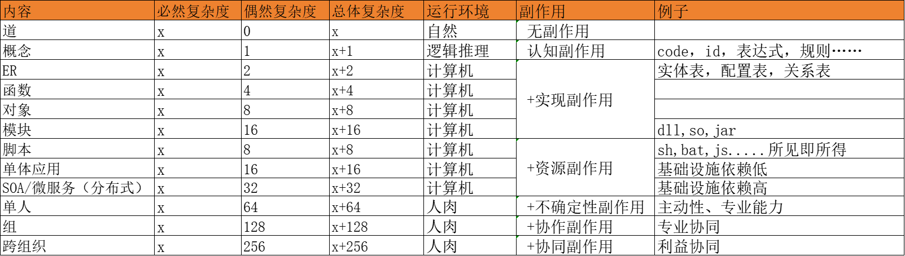
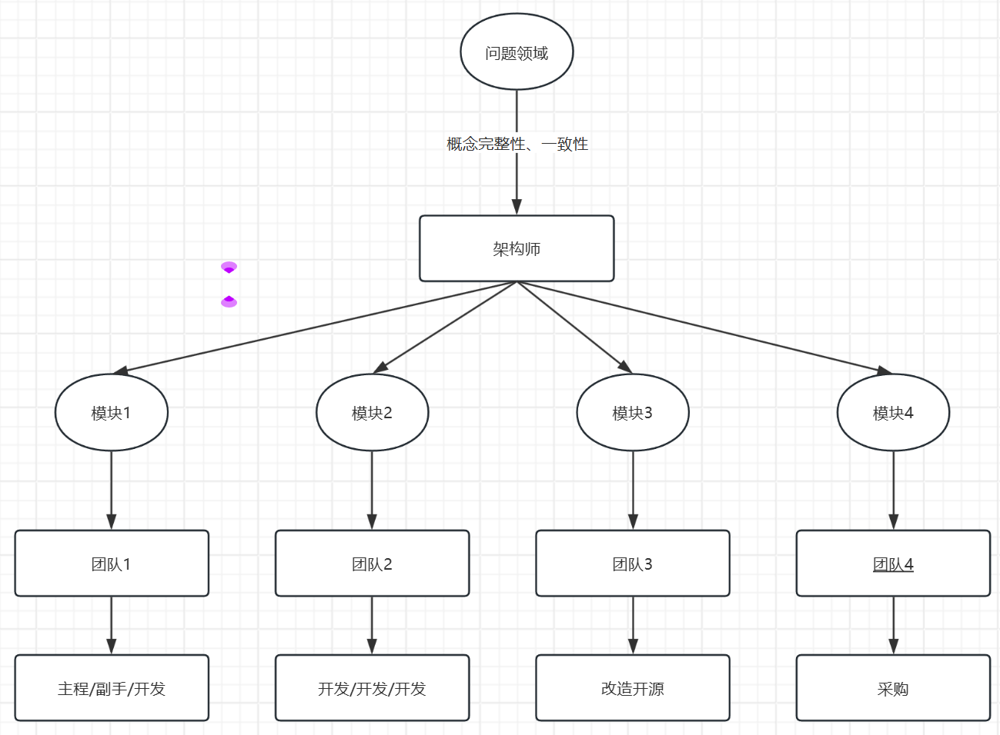

## 什么是熵

1. 物理学中，熵是不做功的能量 
2. 软件工程中，熵是工程中的无效做功。

蚂蚁可以举起自己10倍的重物，是熵减的结果。大型动物行动迟缓，大公司效率低下，是熵增的结果。

规模变大几乎可以肯定复杂度变高、熵增，但结果是涌现，还是混沌，关键看架构。

系统论认为

    简单简单系统，简单，无发展，如真菌
    简单复杂系统，简单，无发展，如沙堆，如海绵，如原核细胞
    
    复杂简单系统，自组织，产生涌现；如真核细胞，如脑细胞，如Agent
    复杂复杂系统，混沌，无发展；如天气，漩涡

复杂简单系统的架构公约数是

1. 有一个最简单的、基本的构造单元
2. 构造单元既足够简单、又足够复杂
3. 系统开放
4. 系统有简单清晰的规则
5. 有层次

## 熵的分类
软件工程上，熵可以做如下分类

1. 设计熵：因为对问题的认识、分析、建模的偏差或者错误引起的无效做功
2. 技术熵：因为错误或者不合适的工具、方法选型引起的无效做功
3. 组织熵：因为不合理的组织、工具、造成过高的协作产生的无效做功

## 熵的基本性质（复杂度）
    
1. 必然复杂度不可降低 
2. 偶然复杂性必然提升

必然复杂度是问题的内在秉性。不可改变，不可降低。

偶然复杂度是解决问题的方式中，因为设计、开发、协作等方式产生的额外复杂度。可以通过一定的方法设计降低。越少、越简单的方法，偶然复杂性越低，涌现性越高。

    
## 技术复杂度降级

1. 在时间和投入允许的情况下，探索尽可能多的可能，并比较。

2. 在满足需求的情况下，优先用复杂度低的技术形态。

 
能用方法表达的，不要设计为应用。

能用对象实现的，不要实现为微服务。

能单机的，不要分布式。

能平铺直叙解决的，就别用设计模式。

能通过数据设计解决的，不要通过对象设计解决。

## 组织复杂度降级

不同业务复杂度形态和不同组织模式。

《人月神话》中推荐了手术团队模式

**架构师：** 概念完整性、一致性以架构师为主。避免民主，避免概念碎片化。
**主程：** 保持复杂模块核心实现完整性、一致性、避免技术腐化。
**依赖模式和防腐层：** 技术手段隔离核心模块
**团队：** 在领域层外，解决规模问题
