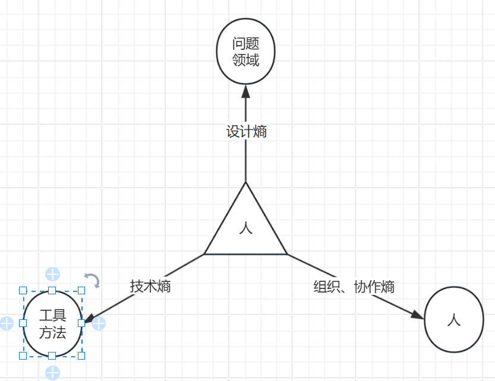

# 什么是熵

1，熵是不做功的能量

2，软件工程中，熵是工程中的无效做功。

    <人月神话>举了巴别塔的例子，来说明软件工程中哪些必然存在，但会降低做功效率的因素。
    
    巴别塔         ：总工作量是一定的复杂项目。
    丰富的人力资源   ：两河流域所有被征服的民族、工匠。
    超高的协作成本   ：不同的语言、不同的文化、不同的职业、不同的思维方式。

    巴别塔是个很极端的例子，熵必不可少，极端复杂系统中会100%。

# 熵的分类

    设计熵：因为对问题的认识、分析、建模的偏差或者错误引起的无效做工
    技术熵：因为错误或者不合适的工具、方法选型引起的无效做功。
    组织熵：因为不合适的组织、协作方式造成的无效做工

# 熵的基本性质
熵是客服复杂度的无效做功，来源于不同性质的复杂度。复杂度按是否可以降低，分为两类

1，必然复杂度

2，偶然复杂度

必然复杂度是问题的内在属性。不可改变，不可降低。

偶然复杂度是解决问题的方式中，因为设计、开发、协作等方式产生的额外复杂度。可以通过一定的
设计降低。

# 降熵设计

## 设计复杂度降级
    1，软件工程中，业务问题优先于技术问题
    2，业务问题中，业务模型优先于具体业务问题。
    3，模型中，流程架构优先于能力组件。
    4，流程中，流程两端的客户优先于流程。
    5，在业务战略中，选取价值重要性、紧急度最高的、分批择机推进。
    
    5层层层分解、聚焦核心复杂度、核心价值。降低次要复杂度。
    
## 技术复杂度降级

1，在时间和投入允许的情况下，探索尽可能多的可能，并比较。

2，在满足需求的情况下，优先用复杂度的低的技术形态。

 
能用方法表达的，不要设计为应用。

能用对象实现的，不要实现为微服务。

能单机的，不要分布式。

能平铺直叙，别设计模式

能通过数据设计解决的，不要通过对象设计解决。 

## 组织复杂度降级

不同业务复杂度形态和不同组织模式。

在《人月神话》书中，推荐手术团队模式

**架构师**：概念完整性、一致性以架构师为主。避免民主，避免概念碎片化。

    架构师+业务专家+技术专家
    1，梳理业务模式
    2，定义好业务能力组件,
    3，定义好产品、开发制品包规范和协作模式。
    确保各角色专业能力可输出为特定的制品包产物、并集成到整体流程中、形成完整、一致的产品。

**主程：** 保持复杂模块核心实现完整性、一致性、避免技术腐化。
    
    主程+产品专家+架构实现核心组件，实现高可扩展，高性能，高可用、高可靠的核心组件。
    1，架构明确ER模型规范
    2，业务专家/产品沉淀需求到对应ER模型和配置
    3，主程实现组件模型核心代码、定义主流程、定义扩展方式
    4，开发实现特定特定配置扩展实现

**依赖模式和防腐层：** 对核心业务耦合度不高的通用技术组件可以采用成熟的开源组件、采购商业成品降低组织复杂度。但需要设计好依赖
模式（数据？服务？)设计好防腐层，做到可切换、风险可控。

大多数公司中，基本都是团队2模式——适用于CRUD等重复性高、业务复杂度不高的模块。

反之，就容易因生产组织方式不对而产生组织熵————例如恒生、赢时胜等公司 新一代估值、清算等系统长期在客户uat环境并发数年、
因为稳定性、性能等问题而无法上线。

1，复杂的系统，很容易因为团队2模式的大规模并发迭代带来块造成系统可靠性、性能的极剧衰减。

2，复杂的系统，避免2模式的碎片化流水线化的开发模式。需要按DDD的实践：沉淀领域模型、事件风暴论证开发模型、
采用主程开发模式确保概念完整性、实现完整性。  而不可能一次次通过碎片化的需求迭代出高可用、高可靠的系统。

猴子不可能敲出莎士比亚的诗句。
 

